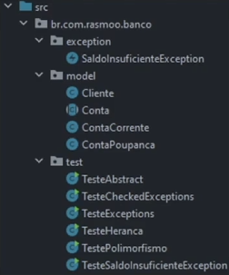

## O QUE SÃO PACOTES?
Os pacotes no Java são basicamente diretórios que servem para organizar seu código, impedir o conflito de nome entre classes
e facilitar a sua localização.
Normalmente, são colocadas em um pacote, classes que possuem um escopo em comum.



### Definindo pacotes
Para dizer que uma classe Java pertence a um determinado pacote, a primeira linha deve ser sempre a declaração desse pacote.

```java
package br.com.rasmoo.banco.model;
```

### Importando classes
Para importar uma classe individualmente, basta utilizar a palavra reservada _`import`_ seguida do caminho completo até essa classe.

```java
import br.com.rasmoo.model.Cliente;
import br.com.rasmoo.model.ContaPoupanca;
import br.com.rasmoo.model.ContaCorrente;
```

Para importar **TODAS** as classes de um pacote, utilizamos também a palavra _`import`_, porém usamos o `*`.

```java
import br.com.rasmoo.model.*;
```

Ao importar uma classe de outro pacote/pasta, me permite trabalhar com classes selecionadas ou todas as classes.

## MODIFICADORES DE ACESSO
Os modificadores de acesso são palavras reservadas da linguagem Java. Elesservem para definir o nível de acesso que
determinado método, atribuo ou classe irá possuir.
Basicamente, o Java possui quatro modificadores de acesso, sendo eles:
- public
- protected
- default
- private

#### Modificador: public
O modificador `public` é o menos restritivo de todos os outros. Quando declaramos classes, atributos ou métodos com este
modificador, automaticamente dizemos que aquela propriedade é acessível a partir de qualquer outro lugar.

```java
public class Endereco {
    public String cpf;
    public String logradouro;
    public String numero;
    public String complemento;
    public String bairro;
    public String cidade;
    public String estado;
}
```

#### Modificador: protected
O modificador `protected`, podemos dizer que um atributo ou método é visível **APENAS** para as _classes do mesmo pacote_ ou para
_subclasses daquela classe (extends)_.

```java
public abstract class Produto {
    protected String nome;
    protected double preco;
    protected String descricao;
    
    protected void aplicarDesconto() {...}
}
```

#### Modificador: default
O modificador `default` é aplicado a todas as classes, atributos ou métodos que NÃO tiveram o seu modificador explicitamente declarado.
Ele permite que _apenas as classes do mesmo pacote tenham acesso as propriedades que possuem este modificador_. NÃO SERVE NA HERANÇA

```java
class Funcionario {
    String nome;
    double salario;
    
    double getBonificacao(){
        return this.salario * 0.2;
    }
}
```

#### Modificador: private
O modificador `private` é o mais restritivo de todos. Toda a característica ou comportamento de uma classe que seja definida
como `private`, só poderá ser acessível dentro da própria classe.
_**Não importa a localização, dentro de pacotes ou não, e nem se a classe foi utilizada na herança, um membro private é 
acessível somente dentro da mesma classe em que ele foi declarado.**_

```java
public abstract class Conta {  

    private int agencia;
    private int numero;
    private Cliente titular;
    private double saldo;
    private static int total;
    
    public Conta(int agencia, int numero, Cliente titular) {
        this.agencia = agencia;
        this.numero = numero;
        this.titular = titular;
        Conta.total++;
    }
}
```