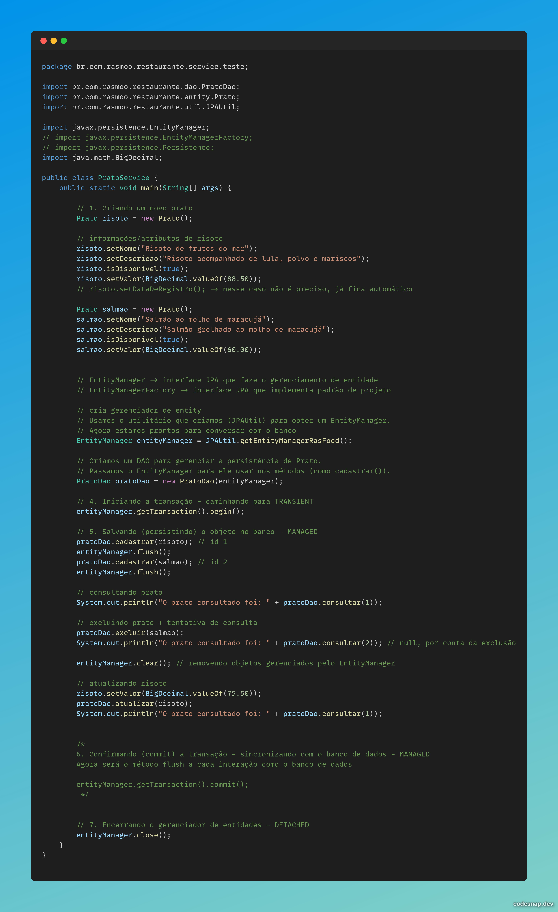
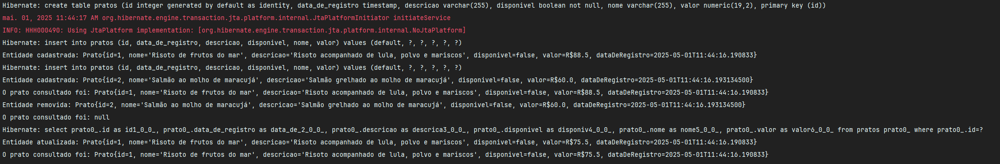

# JPA HIBERNATE e SPRING DATA
💻 **[Projeto Rasfood](https://github.com/ruan-lopes16/rasfood/tree/master)**
---
# JPA Hibernate

## JDBC
- Conjunto de classes/Biblioteca que facilitam o acesso ao banco de dados(Jav Database Connectivity), utilizando JAVA, independente da tecnologia de persistência (tecnologias relacionais)
- Especificação para que seja possível acessar banco de dados relacionais no JAVA de forma abstrata
- Surgimento do DAO(Data acess Object) - isola as configurações do JDBC em um único pacote
`CONTROLER/SERVICE -> CLASSES DAO -> BANCO DE DADOS`

Ex.: invocando classe DAO
```java
public class CadastrarCursoService {
    private CursoDao cursoDao;
    
    public CadastroProdutoService(CursoDao cursoDao){
        this.cursoDao = cursoDao;
    }
    
    public void cadastrarCurso(Curso curso){
        this.cursoDao.salvar(curso)
    }
}
```

por dentro da classe DAO
```java
import java.sql.Connection;
import java.sql.PreparedStatement;

public class CursoDao {
    private Connection connection;

    public CursoDao(Connection connection) {
        this.connection = connection;

    }

    public void salvar(Curso curso) {
        try {
            String query = "INSERT INTO curso(nome, descricao, horas) VALUES(?,?,?)";

            PreparedStatement ps - this.connection.prepareStatement(query);
            ps.setString(1, curso.getNome());
            ps.setString(2, curso.getDescricao());
            ps.setInt(3, curso.getHoras());
            
            ps.execute();
            ps.close();
        } catch (Exception e) {
            throw new RuntimeException("Erro ao salvar o curso", e);
        }
    }
}
```

## JPA
- Alternativa ao JDBC e EJB2
- Mantida pela RedHat
- Projeto engessados por limitação de biblioteca
- padrão ORM(Object Relational Mapping) - mapeamento entre o mundo real e a POO
- logo em seguida, JPA (Java Persistence APO - 2006) como especificação

- Agora não precisa mais importar as clases de outras tecnologias como: Hibernate, OpenJPA ou EclipseLink, basta importar o JPA e as classes irão implementar os métodos do JPA

# Começando um projeto
- Dentro do IntelliJ, ao criar um novo projeto se atentar em criar um projeto **Maven**
- Após criado o projeto é gerado um arquivo `.pom`
```
<?xml version="1.0" encoding="UTF-8"?>
<project xmlns="http://maven.apache.org/POM/4.0.0"
xmlns:xsi="http://www.w3.org/2001/XMLSchema-instance"
xsi:schemaLocation="http://maven.apache.org/POM/4.0.0 http://maven.apache.org/xsd/maven-4.0.0.xsd">
<modelVersion>4.0.0</modelVersion>
    <groupId>org.example</groupId>
    <artifactId>rasfood</artifactId>
    <version>1.0-SNAPSHOT</version>
</project> 
```

## DEPENDÊNCIAS
- Inicialmente precisamos instalar as dependências de banco e hibernate
```xml
<dependencies>
        <!-- https://mvnrepository.com/artifact/org.hibernate/hibernate-entitymanager --> <!-- HIBERNATE -->
        <dependency>
            <groupId>org.hibernate</groupId>
            <artifactId>hibernate-entitymanager</artifactId>
            <version>5.6.15.Final</version>
        </dependency>

        <!-- https://mvnrepository.com/artifact/com.h2database/h2 --> <!-- h2(banco provisório) -->
        <dependency>
            <groupId>com.h2database</groupId>
            <artifactId>h2</artifactId>
            <version>2.3.232</version>
            <scope>test</scope>
        </dependency>
    </dependencies>
```

- Para nosso projeto inicialmente, isso já basta
_ARQUIVO POM COMPLETO_
```xml
<?xml version="1.0" encoding="UTF-8"?>
<project xmlns="http://maven.apache.org/POM/4.0.0"
         xmlns:xsi="http://www.w3.org/2001/XMLSchema-instance"
         xsi:schemaLocation="http://maven.apache.org/POM/4.0.0 http://maven.apache.org/xsd/maven-4.0.0.xsd">
    <modelVersion>4.0.0</modelVersion>

    <groupId>org.example</groupId>
    <artifactId>rasfood</artifactId>
    <version>1.0-SNAPSHOT</version>

    <!-- dependencias de projeto - hibernate e h2(banco provisório) -->
    <dependencies>
        <!-- https://mvnrepository.com/artifact/org.hibernate/hibernate-entitymanager --> <!-- HIBERNATE -->
        <dependency>
            <groupId>org.hibernate</groupId>
            <artifactId>hibernate-entitymanager</artifactId>
            <version>5.6.15.Final</version>
        </dependency>

        <!-- https://mvnrepository.com/artifact/com.h2database/h2 --> <!-- h2(banco provisório) -->
        <dependency>
            <groupId>com.h2database</groupId>
            <artifactId>h2</artifactId>
            <version>2.3.232</version>
            <scope>test</scope>
        </dependency>
    </dependencies>

    <properties>
        <maven.compiler.source>16</maven.compiler.source>
        <maven.compiler.target>16</maven.compiler.target>
        <project.build.sourceEncoding>UTF-8</project.build.sourceEncoding>
    </properties>

</project>
```

**NOTA-SE que as `dependencies` estão antes das `properties`, e sempre que adicionar novas dependências devem ser colocadas dentro de `dependencies`**

## ENTIDADES
- Cria-se um arquivo chamado `persistence.xml` para configuração de database - indicar qual tipo iremos usar, credênciais, dialeto e etc.
- Caminho "padrão":
    📁 src
      └── 📁 main
        └── 📁 resources
            └── 📁 META-INF
                └── 📄 persistence.xml

```xml
<?xml version="1.0" encoding="UTF-8"?>
<persistence version="2.2"
             xmlns="http://xmlns.jcp.org/xml/ns/persistence" xmlns:xsi="http://www.w3.org/2001/XMLSchema-instance"
             xsi:schemaLocation="http://xmlns.jcp.org/xml/ns/persistence http://xmlns.jcp.org/xml/ns/persistence/persistence_2_2.xsd">
    <persistence-unit name="rasFood" transaction-type="RESOURCE_LOCAL">
        <properties>
            <property name="javax.persistence.jdbc.driver" value="org.h2.Driver"/> <!-- driver jdbc/banco de dados que iremos usar -->
            <property name="javax.persistence.jdbc.url" value="jdbc:h2:mem:rasfood"/> <!-- url de banco -> nesse caso url em memória -->
            <property name="javax.persistence.jdbc.user" value="rasmoo"/> <!-- usuário -->
            <property name="javax.persistence.jdbc.password" value=""/> <!-- senha -->
            <property name="hibernate.dialect" value="org.hibernate.dialect.H2Dialect"/> <!-- dialeto da tecnologia sql que está usando --> (palavras-chave)
        </properties>
    </persistence-unit>
</persistence>
```

É graças as **Entidades** que fazemos os relacionamentos/mapeamento do mundo OO ao mundo relacional, com ela podemos modelar as tabelas dentro do mundo Java. Entidades são classes mapeadas com essa notação(entity). - mapear valores do banco.

**Como fazer?**
- é disposto em nível de pacotes, segue exemplo para o aprendizado:
  📁 src
  └── 📁 main
  └── 📁 java
  └── 📁 br
  └── 📁 com
  └── 📁 rasmoo
  └── 📁 restaurante
  └── 📁 entity
  └── classes.java

```java
@Entity
public class Classe {
 // implementação da classe/entidade
}
```

- Dizendo ao JPA que tal classe se trata de uma entidade(tabela do banco de dados):
  `@Entity` -> anotação de `javax.persistence.Entity`
  - Diz que a **classe é uma entidade do banco de dados**.
  - Cada instância da classe representa uma **linha (registro)** em uma tabela.
```java
  @Entity
  public class Usuario { ... }
```

- Dizendo que entidade se trata de uma tabela:
		`Table()` -> dentro de parenteses podemos escolher os parametros
			- Define o **nome da tabela no banco de dados**.
		    - Se você não usar, o nome da tabela será o nome da classe.
		
		- para nossa tabela será: `@Table(name = "pratos")`

✅ `@Id`
- Marca o campo como **chave primária** da tabela.
- O valor desse campo **identifica unicamente** cada registro.

✅ `@Column` com **um único parâmetro**:

Quando você usa `@Column` com apenas **um parâmetro**, você está configurando **uma característica específica** da coluna no banco de dados.

Aqui vão **explicações objetivas** para os usos mais comuns com **um único parâmetro**:


📌 1. `@Column(name = "nome_coluna")`
- Define **qual será o nome da coluna** no banco de dados.
- Útil quando o nome da variável na classe é diferente do nome da coluna.
    
- Exemplo:
    ```java
    @Column(name = "nome_completo") 
    private String nome;
    ```

📌 2. `@Column(nullable = false)`
- Diz que o campo **não pode ser nulo** no banco de dados (ou seja, é obrigatório).
 
- Exemplo:
    ```java
    @Column(nullable = false) 
    private String email;
    ```

📌 3. `@Column(length = 100)`
- Define o **tamanho máximo** da coluna (geralmente para campos `VARCHAR`).
- Exemplo:
```java
@Column(length = 100) 
private String descricao;
```

- JPA obriga ter um construtor vazio:
```java
public Prato() {  
}
```


-  Utilizamos `SEQUENCE`
	A anotação `@GeneratedValue(strategy = GenerationType.IDENTITY)` é usada em Java, especialmente com **JPA (Java Persistence API)**, para indicar que o valor da chave primária de uma entidade será **gerado automaticamente pelo banco de dados**, e não definido manualmente.

##### QUEBRANDO O CÓDIGO...
✅ `@GeneratedValue(...)`
- Diz que o valor da chave primária será **gerado automaticamente**, e você não precisa colocá-lo manualmente ao salvar o objeto no banco.
    
 ✅ `strategy = GenerationType.IDENTITY`
- Essa parte especifica **qual estratégia** será usada para gerar o valor da chave primária.

###### 💡 O que é a estratégia `IDENTITY`?
A estratégia `IDENTITY` faz com que o **banco de dados cuide da geração do ID**, geralmente usando uma **auto-incrementação**.

Ou seja, quando você insere um novo registro, o banco de dados **automaticamente gera o próximo número** da chave primária (por exemplo, 1, 2, 3, 4...).

Exemplo: 
```java
Usuario novo = new Usuario(); novo.setNome("Maria"); usuarioRepository.save(novo);`
```

Você **não precisa** definir o ID. O banco vai gerar sozinho, por exemplo:
```sql
INSERT INTO usuario (nome) VALUES ('Maria');
```

E o banco gera algo como:
```sql
`id = 5`
```

##### 📊 Comparação com outras estratégias:
| Estratégia | Explicação simples                                                     |
| ---------- | ---------------------------------------------------------------------- |
| `IDENTITY` | O banco gera o ID (auto-incremento).                                   |
| `SEQUENCE` | Usa uma **sequência** do banco, muito comum em bancos como PostgreSQL. |
| `TABLE`    | Usa uma tabela separada para controlar os IDs.                         |
| `AUTO`     | Deixa o JPA escolher a melhor estratégia com base no banco usado.      |

#### **ENTIDADE**
```java
package br.com.rasmoo.restaurante.entity;  
  
import javax.persistence.*;  
import java.math.BigDecimal;  
import java.time.LocalDateTime;  
  
@Entity  
@Table(name = "pratos")  
public class Prato {  
  
    @Id     // dizendo que o atributo é um id + definindo primary key
    @GeneratedValue(strategy = GenerationType.IDENTITY)     // estrategia de geração de id -> h2 não aceita SEQUENCE
    private Integer id;  
  
    private String nome;  
    private String descricao;  
    private boolean disponivel;  
    private BigDecimal valor;   // BigDecimal -> utilizado para cálculos decimais de precisão  
  
    // renomeando uma tabela ex.: dataDeRegistro para data_de_registro    @Column(name = "data_de_registro")  
    private LocalDateTime dataDeRegistro = LocalDateTime.now();     // deixando data já registrada  
  
    // JPA obriga ter um construtor vazio    
    public Prato() {  
    }  
    // getters e setters  
    public Integer getId() {  
        return id;  
    }  
  
    public void setId(Integer id) {  
        this.id = id;  
    }  
  
    public String getNome() {  
        return nome;  
    }  
  
    public void setNome(String nome) {  
        this.nome = nome;  
    }  
  
    public String getDescricao() {  
        return descricao;  
    }  
  
    public void setDescricao(String descricao) {  
        this.descricao = descricao;  
    }  
  
    public boolean isDisponivel() {  
        return disponivel;  
    }  
  
    public void setDisponivel(boolean disponivel) {  
        this.disponivel = disponivel;  
    }  
  
    public BigDecimal getValor() {  
        return valor;  
    }  
  
    public void setValor(BigDecimal valor) {  
        this.valor = valor;  
    }  
  
    public LocalDateTime getDataDeRegistro() {  
        return dataDeRegistro;  
    }  
  
    public void setDataDeRegistro(LocalDateTime dataDeRegistro) {  
        this.dataDeRegistro = dataDeRegistro;  
    }  
  
    // toString - exibição  
    @Override  
    public String toString() {  
        return "Prato{" +  
                "id=" + id +  
                ", nome='" + nome + '\'' +  
                ", descricao='" + descricao + '\'' +  
                ", disponivel=" + disponivel +  
                ", valor=R$" + valor +  
                ", dataDeRegistro=" + dataDeRegistro +  
                '}';  
    }  
}
```

## 🔄 Ciclo de Vida de uma Entidade no JPA

As entidades no JPA passam por **quatro estados principais** ao longo do seu ciclo de vida:

> `transient → managed → detached → removed`
### 💡 Exemplo: Instanciando a classe `Prato`

```java
Prato prato = new Prato();  
// setters omitidos  
EntityManager entityManager = JPAUtil.getEntityManager(); entityManager.getTransaction().begin(); entityManager.getTransaction().commit(); 
entityManager.close();
```

---
### 🧠 EntityManager
É o **coração do JPA** — o gerenciador de entidades.  
É por meio dele que realizamos ações como:

- Iniciar e fechar transações
- Persistir objetos no banco
- Atualizar registros

OBS.: Ao iniciarmos nossas transações lidamos com métodos CRUD -> criar, consultar, atualizar e remover (verá mais a frente)

---
### 1️⃣ TRANSIENT — Estado inicial
📌 Ocorre **assim que instanciamos** uma entidade:

- Ela ainda **não foi persistida**
- Não possui `id`
- **Não é gerenciada/monitorada** pela JPA

```java
Prato prato = new Prato(); // estado: TRANSIENT
```

Neste ponto, a entidade ainda **não tem vínculo com o banco**.

### 2️⃣ MANAGED — Entidade gerenciada pela JPA
📌 Ocorre quando chamamos:

```java
entityManager.persist(prato);
```

Agora:
- A JPA **atribui um `id`**
- A entidade passa a ser **monitorada**
- Consegue fazer consultas e atualizar o banco
- Qualquer alteração será sincronizada com o banco ao usar `commit()` ou `flush()`
- `commit()` - final de uma transação -> não consegue dar rollback/defazer sincronização com o banco
- `flush()` - consegue executar diversos flush durante a transação e consegue dar rollback, caso desista da sincronização

✅ Transição para **MANAGED**

---
### 🔄 Transições a partir de MANAGED:

|Método|Ação|
|---|---|
|`close()`|Fecha a transação e "desliga" o gerenciamento da entidade|
|`clear()`|Limpa o contexto de persistência, removendo a entidade do controle|

---
### 3️⃣ DETACHED — Entidade desligada
📌 Acontece após `close()` ou `clear()`:
- A entidade **continua existindo com `id`**, pois já foi persistida
- Mas agora está **fora do controle da JPA**
- **Não há mais sincronismo** automático com o banco de dados

```java
entityManager.close(); // estado: DETACHED
```

> ⚠️ Diferente do `transient`, o `detached` já foi persistido — ele só não é mais gerenciado.


### 4️⃣ REMOVED
📌 Exclui a entidade através do método `remove()`


---
📜 Visualização de Logs no JPA
Para acompanhar as queries (consultas) geradas pelo JPA e monitorar o desempenho da aplicação, configuramos o arquivo `persistence.xml`

🛠 Dentro da tag <properties>::
```java
    <property name="hibernate.show_sql" value="true"/> <!-- Exibe no log as queries SQL geradas -->
    <property name="hibernate.hbm2ddl.auto" value="update"/> <!-- Define como o JPA deve gerenciar o schema (tabelas) - persistir, consultar dados -->
```

📊 Observação Importante:
- Como o H2 Database é um banco de dados temporário (em memória),
➔ Sempre que o serviço é encerrado, todos os dados persistidos são perdidos.

🔧 Opções de `hibernate.hbm2ddl.auto`
Essa propriedade determina como o JPA gerencia as tabelas do banco automaticamente, sem necessidade de scripts manuais.

update	
🔹 Cria e atualiza tabelas automaticamente.
🔹 Não exclui dados existentes.
🔹 Ao reiniciar o serviço, apenas adiciona mudanças necessárias.
create	
🔹 Cria tabelas e colunas.
🔹 Apaga tudo ao reiniciar o serviço.
🔹 Dados não são preservados entre sessões.
create-drop	
🔹 Cria tabelas ao iniciar.
🔹 Exclui as tabelas assim que o serviço é desligado.
validate	
🔹 Valida se as tabelas existentes estão corretas.
🔹 Não cria nem modifica tabelas, apenas verifica.

💡 Resumo:
update: Mais seguro para desenvolvimento — mantém dados.
create e create-drop: Usados para testes rápidos.
validate: Para garantir que o banco já está corretamente estruturado.

---
### 🗂️ Estrutura de Diretórios

- `dao/` → Responsável pelo relacionamento com o banco de dados (operações CRUD).
- `util/` → Classes utilitárias como configuração do JPA e carregamento de dados de teste.
- `service/teste/` → Contém a lógica de negócio, como regras e testes de persistência.

## 🍽️ Persistindo a Entidade `Prato`

Arquivo: `PratoService.java`
```java
package br.com.rasmoo.restaurante.service.teste;  
  
import br.com.rasmoo.restaurante.entity.Prato;  
  
import javax.persistence.EntityManager;  
import javax.persistence.EntityManagerFactory;  
import javax.persistence.Persistence;  
import java.math.BigDecimal;  
  
public class PratoService {  
    public static void main(String[] args) {  
  
        // 1. Criando um novo prato  
        Prato risoto = new Prato();  
  
        // informações/atributos de risoto  
        risoto.setNome("Risoto de frutos do mar");  
        risoto.setDescricao("Risoto acompanhado de lula, polvo e mariscos");  
        risoto.isDisponivel(true);  
        risoto.setValor(BigDecimal.valueOf(88.50));  
        // risoto.setDataDeRegistro(); -> nesse caso não é preciso, já fica automático  
  
        // persistindo informações na tabela        
        // EntityManager -> interface JPA que faze o gerenciamento de entidade        
        // EntityManagerFactory -> interface JPA que implementa padrão de projeto  
        // 2. Criando a fábrica de EntityManager (padrão Factory)       
        // "padrão de projeto" factory - persistindo entidade, passando como parametro persistence.xml >>> <persistence-unit name="rasFood"> - pegamos apenas o name        
        EntityManagerFactory entityManagerFactory = Persistence.createEntityManagerFactory("rasFood");  
  
        // 3. Criando o gerenciador de entidades (EntityManager)  
        // criando o EntityManager a partir do Factory        
        EntityManager entityManager = entityManagerFactory.createEntityManager();  
  
        // 4. Iniciando a transação  
        // iniciando transações - caminhando para TRANSIENT        
        entityManager.getTransaction().begin();  
  
        // 5. Salvando (persistindo) o objeto no banco  
        // persistindo a entidade - MANAGED        
        entityManager.persist(risoto);  
  
        // 6. Confirmando (commit) a transação  
        // sincronizando com o banco de dados - MANAGED        
        entityManager.getTransaction().commit();  
  
        // 7. Encerrando o gerenciador de entidades  
        // fechando transação - DETACHED        
        entityManager.close();  
    }  
}
```
### 🧠 Conceitos Importantes:

| Conceito               | Explicação                                                                                       |
| ---------------------- | ------------------------------------------------------------------------------------------------ |
| `EntityManagerFactory` | Cria `EntityManager`s, implementa o padrão de projeto _Factory_.                                 |
| `EntityManager`        | Gerencia o ciclo de vida das entidades (`TRANSIENT`, `MANAGED`, `DETACHED`).                     |
| `persist()`            | Salva o objeto na base de dados (estado `MANAGED`).                                              |
| `commit()`             | Finaliza e sincroniza a transação com o banco.                                                   |
| `close()`              | Desanexa a entidade (`DETACHED`).                                                                |
| `Persistence` (classe) | Classe utilitária da JPA que **lê o arquivo `persistence.xml`** e cria a `EntityManagerFactory`. |

---
# JPAUtil e padrão DAO
Ao trabalhar com JPA, é comum usar os objetos `EntityManager` e `EntityManagerFactory` em várias classes. Para **evitar repetição de código** e **organizar melhor a arquitetura**, usamos duas boas práticas:

1. **Classe utilitária (`JPAUtil`)** para isolar a criação do `EntityManager`
2. **Padrão de projeto DAO (Data Access Object)** para isolar a lógica de persistência.

---

## 📁 1. Classe `JPAUtil` — Centralizando o acesso ao banco


```java
package br.com.rasmoo.restaurante.util;  
import javax.persistence.EntityManager; 
import javax.persistence.EntityManagerFactory; 
import javax.persistence.Persistence;  

public class JPAUtil {     
	// Criando uma única instância da Factory (padrão Singleton) >>> RASFOOD > conforme persistence.xml "rasFood"
	private static final EntityManagerFactory RASFOOD = Persistence.createEntityManagerFactory("rasFood");  
	    
	// Método que entrega um novo EntityManager     
	public static EntityManager getEntityManagerRasFood() {         
		return RASFOOD.createEntityManager();     
	} 
}
```

### ✅ Explicação

- **`RASFOOD`**: é a fábrica (`EntityManagerFactory`) criada apenas uma vez (Singleton).
- **`getEntityManagerRasFood()`**: retorna um `EntityManager` novo sempre que for chamado.
- Evitamos duplicar a criação da factory, que é **custosa** e deve ser feita **apenas uma vez**.


---

## 🧱 2. Classe `PratoDao` — Aplicando o padrão DAO

```java
package br.com.rasmoo.restaurante.dao;  
import br.com.rasmoo.restaurante.entity.Prato; 
import javax.persistence.EntityManager;  

public class PratoDao {     
	private EntityManager entityManager;   
	   
	public PratoDao(EntityManager entityManager) {         
		this.entityManager = entityManager;     
	}      
	
	public void cadastrar(Prato prato) {         
		this.entityManager.persist(prato);         
		System.out.println("Entidade cadastrada: " + prato);     
	} 
}
```

### ✅ Explicação

- Essa classe representa o **acesso aos dados da entidade `Prato`**.
- O método `cadastrar()` cuida de **persistir** (salvar) um objeto no banco.
- O DAO é responsável apenas pelas **operações com o banco**, deixando a regra de negócio separada.
- Ele será usado em todos os métodos do DAO para persistir, buscar, atualizar ou remover objetos do banco.


---

## 🚀 3. Classe `PratoService` — Executando a lógica com o DAO

```java
package br.com.rasmoo.restaurante.service.teste;  
import br.com.rasmoo.restaurante.dao.PratoDao; 
import br.com.rasmoo.restaurante.entity.Prato; 
import br.com.rasmoo.restaurante.util.JPAUtil;  
import javax.persistence.EntityManager; 
import java.math.BigDecimal;  

public class PratoService {     
public static void main(String[] args) {   

// 1. Criando o objeto Prato (estado NEW)         
	Prato risoto = new Prato();         
	risoto.setNome("Risoto de frutos do mar");         
	risoto.setDescricao("Risoto acompanhado de lula, polvo e mariscos");        
	risoto.isDisponivel(true);         
	risoto.setValor(BigDecimal.valueOf(88.50));         
// A data de registro é automática         

// 2. Obtendo EntityManager através do JPAUtil         
	EntityManager entityManager = JPAUtil.getEntityManagerRasFood();          
// 3. Criando o DAO e iniciando transação         
	PratoDao pratoDao = new PratoDao(entityManager);         
	entityManager.getTransaction().begin();          

// 4. Persistindo o prato (estado MANAGED)         
	pratoDao.cadastrar(risoto);          

// 5. Finalizando a transação (commit)         
	entityManager.getTransaction().commit();          

// 6. Fechando o EntityManager (estado DETACHED)         
	entityManager.close();     
	} 
}
```
## 🧠 Vantagens dessa arquitetura

| Item            | Benefício                                                    |
| --------------- | ------------------------------------------------------------ |
| 🔁 `JPAUtil`    | Evita repetição de código para criar `EntityManager`         |
| 🧱 `DAO`        | Isola a lógica de acesso ao banco                            |
| 📦 `Service`    | Foca apenas na regra de negócio (organização em camadas)     |
| 🧼 Código limpo | Cada classe tem uma única responsabilidade (princípio SOLID) |

---
DESTRINCHANDO:
## ✅ Classe `JPAUtil`

### Finalidade:
Centralizar a criação do `EntityManager` usando o padrão Singleton + Factory. Isso **evita repetição de código** e melhora a manutenção do projeto.

`public class JPAUtil {`
- Estamos declarando uma classe pública chamada `JPAUtil`.
- `Util` significa que é uma classe utilitária, ou seja, **oferece métodos auxiliares** que outras classes podem usar.

```java
private static final EntityManagerFactory RASFOOD = Persistence.createEntityManagerFactory("rasFood");
```

- Aqui temos um atributo chamado `RASFOOD`:
    - `private`: só acessível dentro da classe.
    - `static`: pertence à classe, não precisa de instância para ser acessado.
    - `final`: o valor não muda depois de ser criado.

- `EntityManagerFactory`: objeto pesado que **cria** EntityManagers.

- `Persistence.createEntityManagerFactory("rasFood")`: chama o método da JPA que **lê o arquivo `persistence.xml`** e procura a `persistence-unit` com nome `"rasFood"`.
    - Esse nome precisa bater com o `<persistence-unit name="rasFood">` do seu XML.


🔁 **Padrão de Projeto usado aqui:**
- **Factory**: cria objetos para você.
- **Singleton**: só cria uma única instância do factory.

```java
public static EntityManager getEntityManagerRasFood() {         
	return RASFOOD.createEntityManager();     
}
```

- Método **estático**, então pode ser chamado assim: `JPAUtil.getEntityManagerRasFood()`.
- Ele usa a `RASFOOD` (a fábrica) para **gerar um novo `EntityManager`**.
- Toda vez que precisar interagir com o banco, você chama esse método.

---
## ✅ Classe `PratoDao`

### Finalidade:
Aplicar o padrão DAO (Data Access Object), que **organiza e separa o acesso ao banco de dados da lógica de negócio**.

`public class PratoDao {`
- Criamos uma classe pública chamada `PratoDao`. Ela será responsável por tudo relacionado ao banco de dados da entidade `Prato`.

```java
private EntityManager entityManager;
```
- Criamos um campo privado que vai armazenar o `EntityManager`.

- Cada instância do `PratoDao` vai usar esse `EntityManager` para executar operações.

```java
public PratoDao(EntityManager entityManager) {         
	this.entityManager = entityManager;     
}```
- Construtor da classe.

- Quando você cria um `PratoDao`, você **obriga** a passar um `EntityManager` (injeção manual de dependência).

```java
public void cadastrar(Prato prato) {         
	this.entityManager.persist(prato);         
	System.out.println("Entidade cadastrada: " + prato);     
}
```
- Método público `cadastrar()` que recebe um `Prato` como argumento.
- Usa o `entityManager` para persistir (salvar) o objeto.
- Exibe no console que o prato foi cadastrado, para facilitar o debug.

---

## ✅ Classe `PratoService`
### Finalidade:
Simula a camada de serviço, onde a lógica principal da aplicação acontece. Aqui você **usa os objetos DAO e utilitários** para realizar as ações.

---

### 🔹 Parte 1 – Criando um novo objeto
`Prato risoto = new Prato();`
- Criamos um novo objeto da classe `Prato`.
- Neste momento ele está em memória e **não tem vínculo com o banco** ainda.
- Estado da JPA: `NEW`.

```java
risoto.setNome("Risoto de frutos do mar");         
risoto.setDescricao("Risoto acompanhado de lula, polvo e mariscos");         
risoto.setDisponivel(true);         
risoto.setValor(BigDecimal.valueOf(88.50));
```
- Preenchendo os campos do objeto.
- `setDisponivel(true)` define que o prato está disponível.
- `setValor(...)` usa `BigDecimal`, que é a forma correta de representar dinheiro no Java (evita erros de arredondamento).

---
### 🔹 Parte 2 – Preparando a persistência com JPA
`EntityManager entityManager = JPAUtil.getEntityManagerRasFood();`
- Usamos o utilitário que criamos (`JPAUtil`) para obter um `EntityManager`.
- Agora estamos prontos para conversar com o banco.

`PratoDao pratoDao = new PratoDao(entityManager);`
- Criamos um DAO para gerenciar a persistência de `Prato`.
- Passamos o `EntityManager` para ele usar nos métodos (como `cadastrar()`).

---
### 🔹 Parte 3 – Persistindo com segurança
`entityManager.getTransaction().begin();`
- Começamos uma transação JPA.
- JPA exige que você comece uma transação antes de fazer alterações no banco (como persistência, atualização, etc).

`pratoDao.cadastrar(risoto);`
- Usamos o DAO para salvar o prato no banco.
- Neste momento a JPA muda o estado do objeto para `MANAGED`.

`entityManager.getTransaction().commit();`
- Finalizamos a transação e confirmamos tudo o que foi feito.
- O `commit()` salva efetivamente os dados no banco.

`entityManager.close();`
- Fechamos o `EntityManager`.
- O objeto agora está no estado `DETACHED` (desconectado da JPA).

---
## 🔄 Ciclo de Vida da Entidade (JPA)

| Estado     | Quando acontece                        | Descrição                                   |
| ---------- | -------------------------------------- | ------------------------------------------- |
| `NEW`      | `new Prato()`                          | Criado em memória, ainda não está no banco. |
| `MANAGED`  | `entityManager.persist(prato)`         | Agora está sendo "controlado" pela JPA.     |
| `DETACHED` | `entityManager.close()` ou após commit | Está salvo no banco, mas fora da JPA.       |
| `REMOVED`  | `entityManager.remove(prato)`          | Está marcado para ser excluído.             |

Para acompanhar as **queries** (consultas) geradas pelo JPA e monitorar o **desempenho** da aplicação, configuramos o arquivo `persistence.xml`.

🛠 Dentro da tag `<properties>`:
```java  
    <property name="hibernate.show_sql" value="true"/> <!-- Exibe no log as queries SQL geradas -->    
    <property name="hibernate.hbm2ddl.auto" value="update"/> <!-- Define como o JPA deve gerenciar o schema (tabelas) - persistir, consultar dados -->  
```

📊 Observação Importante:
- Como o H2 Database é um banco de dados temporário (em memória),  
  ➔ Sempre que o serviço é encerrado, todos os dados persistidos são perdidos.

🔧 Opções de `hibernate.hbm2ddl.auto`  
Essa propriedade determina como o JPA gerencia as tabelas do banco automaticamente, sem necessidade de scripts manuais.

*Valor -> Comportamento*
- update -> Atualiza o banco sem apagar dados. Se derrubar e subir o serviço, adiciona apenas o que estiver faltando. (Mais seguro para desenvolvimento)
- create -> Cria as tabelas toda vez que o serviço inicia, apagando tudo o que havia anteriormente.
- create-drop -> Cria as tabelas ao iniciar o serviço e as apaga automaticamente ao encerrar.
- validate -> Apenas valida se as tabelas estão corretas, sem alterar nada no banco. Útil para verificar a estrutura em produção.

---
# 🪛 Implementação CRUD na classe DAO
C = CREATE
R = READ
U = UPDATE
D = DELETE

---

## 🔵 CREATE: `cadastrar()`
```java
public void cadastrar(final Prato prato){     
	this.entityManager.persist(prato);     
	System.out.println("Entidade cadastrada: " + prato); 
}
```

### Explicação:

- `public void cadastrar(...)`:  
  Um método público que **não retorna nada** (`void`) e recebe um objeto do tipo `Prato`.

- `this.entityManager.persist(prato);`:  
  Esse comando **diz para o Hibernate armazenar o objeto `prato` no banco de dados**.  
  ✅ Requisitos:
    - O objeto deve estar no estado **"transient"** (ainda não persistido).
    - Após o `persist()`, o objeto entra no estado **"managed"**, ou seja, está sendo monitorado pelo Hibernate.

---

## 🔵 READ: `consultar()`

```java
public Prato consultar(final Integer id){     
	return this.entityManager.find(Prato.class, id); 
	}
```

### Explicação:
- `public Prato consultar(...)`:  
  Um método que **retorna um objeto `Prato`** e recebe um `id` como argumento.

- `this.entityManager.find(Prato.class, id);`:  
  Essa linha **procura no banco de dados um objeto da classe `Prato` com o ID fornecido**.


✅ O método `find`:
- Recebe dois argumentos: a classe da entidade (`Prato.class`) e o valor da chave primária (`id`)

- Retorna:
    - O objeto correspondente (se encontrado)
    - `null` se não encontrar
---

## 🔵 UPDATE: `atualizar()`

```java
public void atualizar(final Prato prato){     
	this.entityManager.merge(prato);     
	System.out.println("Entidade atualizada: " + prato); 
}
```

### Explicação:
- `public void atualizar(...)`:  
    Método que atualiza os dados de um `Prato`. Ele **não retorna nada**.
    
- `this.entityManager.merge(prato);`:  
    Esse método serve para **atualizar um objeto que já existe no banco**.  
    Mas ele também pode ser usado para:
    
    - **"reativar" um objeto que estava no estado "detached"** (fora do controle do Hibernate).
    - Criar um **novo objeto gerenciado**, com os dados do objeto que você passou.

⚠️ Importante:
- O objeto original (`prato`) **não é atualizado diretamente**, mas o `merge` retorna uma nova instância **gerenciada**.
- Você **deve usar o valor retornado por `merge`** se quiser continuar trabalhando com o objeto dentro do contexto da JPA.

---

## 🔵 DELETE: `excluir()`

```java
public void excluir(final Prato prato){     
	this.entityManager.remove(prato);     
	System.out.println("Entidade removida: " + prato); 
}
```

### Explicação:
- `public void excluir(...)`:  
    Método que remove um objeto do tipo `Prato`.
    
- `this.entityManager.remove(prato);`:  
    Esse comando **exclui o objeto do banco de dados**.  
    ⚠️ Requisitos:
    - O objeto **precisa estar no estado "managed"**.
    - Se estiver "detached", o `remove()` lançará uma exceção.

### Testandos métodos DAO




FOI FEITO UMA REFATORAÇÃO NO CÓDIGO
Onde era prato nas classes anteriores virou cardapio
Ex.: 
PratoDao >>> CardapioDao
Prato >>> Cardapio
PratoService >>> CardapioService

---

# 📚 Tipos de Relacionamentos em JPA

## 1. `@OneToOne` – Um para Um
### 📖 Definição:
> Uma entidade está relacionada com exatamente uma outra entidade.

### 💡 Exemplo:
- Uma pessoa tem um único passaporte.
- Um passaporte pertence a uma única pessoa.

### 🧩 Código:

```java
@Entity 
public class Pessoa {     
	@Id     
	private Long id;      
	@OneToOne     
	private Passaporte passaporte; 
}```

```java
@Entity 
public class Passaporte {     
	@Id     
	private Long id;      
	@OneToOne(mappedBy = "passaporte") // lado inverso     
	private Pessoa pessoa; 
}
```

---

## 2. `@OneToMany` – Um para Muitos
### 📖 Definição:
> Uma entidade pode estar relacionada com várias instâncias de outra entidade.
### 💡 Exemplo:
- Um cliente faz vários pedidos.
- Um pedido pertence a um único cliente.

### 🧩 Código:

```java
@Entity 
	public class Cliente {     
	@Id     private Long id;      
	@OneToMany(mappedBy = "cliente")     
	private List<Pedido> pedidos; }
```

```java
@Entity 
public class Pedido {     
	@Id     
	private Long id;      
	@ManyToOne     
	private Cliente cliente; 
}
```

---

## 3. `@ManyToOne` – Muitos para Um
### 📖 Definição:
> Muitas instâncias de uma entidade estão relacionadas a uma única instância de outra.

### 💡 Exemplo:
- Vários livros podem ter o mesmo autor.
- Um livro tem apenas um autor.

### 🧩 Código:
```java
@Entity 
public class Livro {     
	@Id     
	private Long id;      
	@ManyToOne     
	private Autor autor; 
}
```

```java
@Entity 
public class Autor {     
	@Id     
	private Long id;      
	@OneToMany(mappedBy = "autor")     
	private List<Livro> livros; 
}
```

---

## 4. `@ManyToMany` – Muitos para Muitos
### 📖 Definição:
> Muitas instâncias de uma entidade estão relacionadas a muitas de outra entidade.

### 💡 Exemplo:
- Um aluno pode estar matriculado em várias disciplinas.
- Uma disciplina pode ter vários alunos.

### 🧩 Código:


```java 
@Entity 
public class Aluno {     
	@Id     
	private Long id;      
	@ManyToMany     
	private List<Disciplina> disciplinas; 
}
```


```java
@Entity 
public class Disciplina {
	@Id     
	private Long id;      
	@ManyToMany(mappedBy = "disciplinas")     
	private List<Aluno> alunos; 
}
```

---

# 🏗️ Tabela de Referência

|Tipo|Anotação|Exemplo|Tabela com FK|
|---|---|---|---|
|Um para Um|`@OneToOne`|Pessoa → Passaporte|Depende de quem for dono|
|Um para Muitos|`@OneToMany`|Cliente → Pedidos|Pedidos tem FK cliente|
|Muitos para Um|`@ManyToOne`|Pedido → Cliente|Pedidos tem FK cliente|
|Muitos a Muitos|`@ManyToMany`|Aluno ↔ Disciplinas|Tabela intermediária|

---

# 🔍 Extras Importantes

### `@JoinColumn`

Define a coluna da **chave estrangeira** (FK).

```java
@ManyToOne 
@JoinColumn(name = "autor_id") 
private Autor autor;
```

### `@JoinTable`

Usado em `@ManyToMany` para definir a **tabela intermediária**.

```java
@ManyToMany 
@JoinTable(
	name = "aluno_disciplina",     
		joinColumns = @JoinColumn(name = "aluno_id"),
		inverseJoinColumns = @JoinColumn(name = "disciplina_id") 
	) 
	private List<Disciplina> disciplinas;
```

---

# 🧪 Testando na prática

Você pode criar um banco H2 e colocar os dados com `data.sql`, ou usar um `CommandLineRunner` para carregar objetos e salvar no banco para ver os relacionamentos funcionando.

---
# 🧩 O que é o `mappedBy`?

## 📖 Definição simples:

> Atributo `mappedBy` **indica qual lado do relacionamento "possui" a relação no banco de dados**.  
> Ele é usado no **lado inverso** do relacionamento para dizer:  
> 👉 "Ei, quem realmente cuida da foreign key é aquele outro lado."

---

## 🧠 Analogia para facilitar:

Imagine dois objetos: **Cliente** e **Pedido**.  
Um cliente pode fazer vários pedidos (`@OneToMany`), e um pedido pertence a um único cliente (`@ManyToOne`).

Quem **possui a chave estrangeira no banco?**  
➡ O `Pedido`! Porque a tabela `pedido` vai ter uma coluna chamada `cliente_id`.

### ✍️ Código:


```java
@Entity 
public class Cliente {
	@Id     
	private Long id;      
	@OneToMany(mappedBy = "cliente")  // cliente é o nome do atributo na classe Pedido     
	private List<Pedido> pedidos; 
}
```


```java
@Entity 
public class Pedido {
	@Id     
	private Long id;      
	@ManyToOne     
	@JoinColumn(name = "cliente_id") // essa é a coluna no banco     
	private Cliente cliente; 
}
```

---

## 🔍 O que o `mappedBy = "cliente"` quer dizer?

> “Olha, **eu (Cliente)** estou no lado **inverso** da relação.  
> Quem **controla a foreign key no banco** é o campo `cliente` da entidade `Pedido`.”

Sem o `mappedBy`, o JPA **cria duas tabelas de ligação desnecessárias** ou uma coluna extra — ele não entende quem realmente "manda" na relação.

---

## ⚠️ Quando usar `mappedBy`?

- Sempre que você estiver fazendo o **lado inverso** da relação:
    - Em `@OneToMany` (lado 1) → `mappedBy` aponta para o campo com `@ManyToOne`.

    - Em `@OneToOne` (lado 1) → `mappedBy` aponta para o campo com `@OneToOne`.

    - Em `@ManyToMany` (lado secundário) → `mappedBy` aponta para o campo que usa `@JoinTable`.

---
## ✅ Regra de ouro:

- **Quem tem o `mappedBy` é o lado passivo da relação.**

- **Quem tem `@JoinColumn` ou `@JoinTable` é o lado que "controla" a foreign key.**