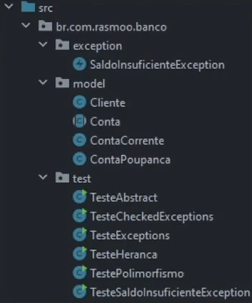

## O QUE SÃO PACOTES?
Os pacotes no Java são basicamente diretórios que servem para organizar seu código, impedir o conflito de nome entre classes
e facilitar a sua localização.
Normalmente, são colocadas em um pacote, classes que possuem um escopo em comum.



### Definindo pacotes
Para dizer que uma classe Java pertence a um determinado pacote, a primeira linha deve ser sempre a declaração desse pacote.

```java
package br.com.rasmoo.banco.model;
```

### Importando classes
Para importar uma classe individualmente, basta utilizar a palavra reservada _`import`_ seguida do caminho completo até essa classe.

```java
import br.com.rasmoo.model.Cliente;
import br.com.rasmoo.model.ContaPoupanca;
import br.com.rasmoo.model.ContaCorrente;
```

Para importar **TODAS** as classes de um pacote, utilizamos também a palavra _`import`_, porém usamos o `*`.

```java
import br.com.rasmoo.model.*;
```

Ao importar uma classe de outro pacote/pasta, me permite trabalhar com classes selecionadas ou todas as classes.