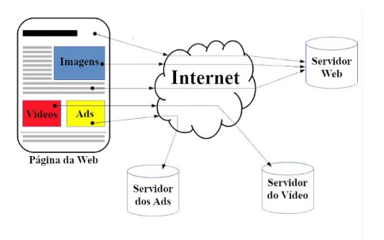
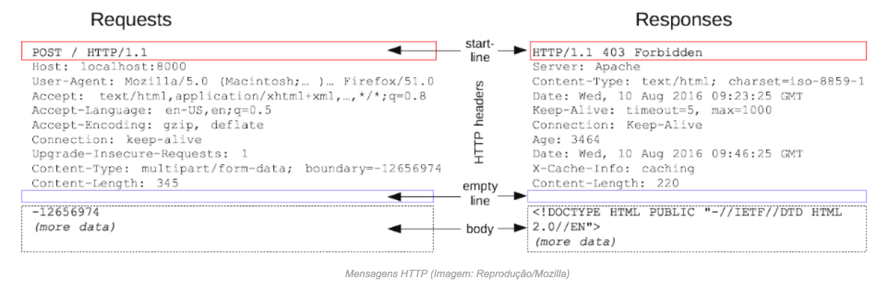
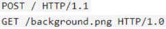
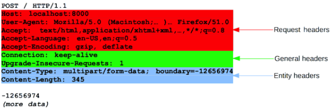
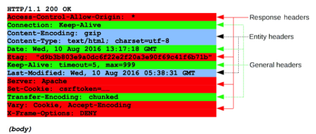
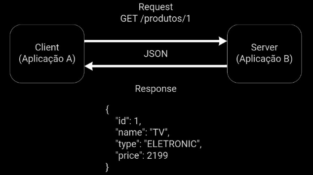

# Entendendo da base da comunicação web!
# O QUE É HTTP?
- HTTP - Hypertext Transfer Protocol
- É um protocolo que permite a obtenção de recursos na web
- Responsável por especificar como será a comunicação entre um cliente e um servidor, e qual ação deseja executar
- Esse sistema é a **base** da comunicação que existe em toda a Internet

## Funcionamento do HTTP
O protocolo utiliza uma estrutura de cliente-servidor, ou seja:
- O cliente daz uma solicitação
- Ao fazer uma requisição/solicitação é enviada uma mensagem HTTP é enviada para o servidor
- O servidor recebe a mensagem e processa a informação
- Depois que a informação é processada, o servidor retorna uma resposta ao cliente

  
## HTTP vs HTTPs
- O Hypertext Transfer Protocol Secure, ou somente HTTPS, é um protocolo HTTP utilizado em conjunto com o Certificado SSL
- A sigla SSL significa Secure Sockets Layer. Essa tecnologia permite a _criptografia dos dados que trafegam entre o cliente e o servidor certificado_, 
além de ser o método mais utilizado para manter a segurança de sites e serviços na web
- O uso do HTTPS pode trazer diversos benefícios que valem tanto para site quanto para seus usuários
Há duas frentes importantes que justificam seu uso: **otimização de desempenho e engajamento com o público**

**HTTP**
- Começa com http://
- Utiliza a porta 80
- Não é seguro
- Trafega dados em formato de hipertexto

**HTTPS**
- Começa com https://
- Utiliza a porta 443
- Seguro, utiliza a tecnologia SSL
- Trafega dados em formato criptografado

### VANTAGENS DE UTILIZAR HTTPS
- **Privacidade de dados**
  - Troca de informações de forma segura, utilizando criptografia

- **Menor taxa de rejeição**
  - Se o site é apontado como seguro, é natural que os usuários sintam mais confiança e continuem navegando nas páginas

- **Aplicação melhor rankeada**
  - Melhores estratégias de SEO 
  - Visibilidade(motores de busca em navegadores), maior tráfego, mais conversões

- **Mais conversões**
  - É possível realizar qualquer conversão, seja relacionada a vendas, tráfegos, leads, entre outros (Em outras palavras, qualquer coisa que chame atenção do usuário)
  No entanto, para que isso aconteça, é importante que o site seja um ambiente seguro, o que incentivará o usuário a permanecer ali

## MENSAGENS HTTP
- As informações são trocadas entre servidor e cliente através mensagens HTTP. Essa comunicação ocorre através de _requisições_ e _respostas_
- As requisições e respostas HTTP possuem uma estrutura semelhante e são compostas de:

1. Linha inicial(start line)
2. Cabeçalhos HTTP(headers)
3. Linha em branco(empty line)
4. Corpo da resposta/requisição contendo as informações trafegadas(body) - nem sempre está presente, tanto nos request quanto nos response (Opcional)

ESCRITO...
*REQUESTS*
POST / НTTP/1.1                                                 <- START LINE
Host: localhost: 8000                                                   \/
User-Agent: Mozilla/5.0 (Macintosh;... )... Firefox/51.0                |
Accept: text/html, application/xhtml-xml,..., */*;q=0.8                 |
Accept-Language: en-US,en;q=0.5                                         |
Accept-Encoding: gzip, deflate                                       HTTP headers
Connection: keep-alive                                                  |
Upgrade-Insecure-Requests: 1                                            |
Content-Type: multipart/form-data; boundary=-12656974                   |
Content-Length: 345                                                     /\
                                                                <- empty line
-12656974                                                         <- body
(more data)                                                             |

*RESPONSES*
HTTP/1.1 403 Forbidden                                            <- START LINE
Server: Apache                                                          \/
Content-Type: text/html; charset=iso-8859-1                             |
Date: Wed, 10 Aug 2016 09:23:25 GMT                                     |
Keep-Alive: timeout=5, max=1000                                         |
Connection: Keep-Alive                                              HTTP headers
Age: 3464                                                               |
Date: Wed, 10 Aug 2016 09:46:25 GMT                                     |
X-Cache-Info: caching                                                   |
Content-Length: 220                                                    /\
                                                                  <- empty line
<!DOCTYPE HTML PUBLIC "-//IETF//DTD HTML 2.0//EN">                  <- body 
(more data)                                                             |

## REQUISIÇÕES HTTP
A requisição é um pedido que um cliente realiza para um servidor. Esse pedido contém uma série de dados que são utilizados para descrever o que o cliente precisa
Basicamente são mensagens HTTP enviadas pelo cliente para iniciar uma determinada ação no servidor

As requisições possuem a seguinte estrutura:
- Linha inicial
- Cabeçalhos
- Corpo da requisição

Suas linhas iniciais contêm três elementos:
- Método HTTP (verbo)
    Descreve qual ação a ser executada
- Path (caminho, qual o recurso, qual o caminho - fazendo a requisição para onde)
  O alvo da requisição, normalmente um URL
- Versão do protocolo
  A versão _HTTP_, que define a estrutura do restante da mensagem, atuando como um indicador da versão esperada para uso na resposta

A seguir duas requisições

`   POST / HTTP/1.1
    GET / backgroung.png HTTP/1.0
`
| método = POST e GET
| path = HTTP e backgroung.png HTTP
| versão = 1.1 e 1.0

Os cabeçalhos contém informações adicionais para os servidores
Existem diversos cabeçalhos de requisição disponíveis e eles podem ser divididos nos seguintes grupos:

- _Cabeçalhos gerais_
Podem ser usados tanto em solicitações quanto em respostas, porém SEM relação com os dados eventualmente transmitidos no corpo da mensagem

- _Cabeçalhos de requisição_
Contém mais informação sobre o recurso a ser obtido ou sobre o próprio cliente

- _Cabeçalhos de entidade_
Contém mais informação sobre o conteúdo da entidade, como o tamanho do conteúdo ou o seu media type(MIME type)
- 

REQUEST HEADERS
`   POST / HTTP/1.1
    Host: localhost:8000
    User-Agent: Mozilla/5.0 (Macintosh; ...) ... Firefox/51.0
    Accept: text/html,application/xhtml+xml,...,*/*;q=0.8
    Accept-Language: en-US,en;q=0.5
    Accept-Encoding: gzip, deflate`
GENERAL HEADERS
`   Connection: keep-alive
    Upgrade-Insecure-Requests: 1`  
ENTITY HEADERS
`   Context-Type> multipart/form-data; boundary=-12656974
    Context-Length: 345`
BODY
-12656974
(more data)

A última parte de uma requisição HTTP é o corpo, mas nem todas as requisições possuem um.
As requisições que _pegam/buscam_ recursos, normalmente NÃO possuem um corpo e já aquelas que precisam atualizar ou cadastrar determinado recurso, 
necessitam enviar informações para o servidor, nesse caso é necessário o uso do body

## REPOSTAS
Aprendemos que o cliente envia uma requisição ao servidor, que por sua vez recebe essas informações e retorna uma resposta ao cliente. 
Essa resposta pode conter os dados que o cliente espera receber ou uma resposta informando que alguma coisa deu errado
As respostas HTTP possuem a seguinte estrutura:
Linha de status
Cabeçalhos
Corpo da resposta

A linha inicial de uma resposta HTTP, chamada de _linha de status_, contém as seguintes informações:

- A versão do protocolo, normalmente HTTP/1.1
- Um código de status que indica se a requisição foi processada com sucesso ou se houve alguma falha
  - Os códigos mais comuns são 200, 400, 404 e 500. 
    - Um texto de status que descreve brevemente o código de status

        `HTTP/1.1`         `200`          `OK`
version of the protocol, status code, status message

Para cada resposta enviada pelo servidor, existe um código responsável por indicar o que aconteceu.
Esses códigos estão entre 100 e 500, sendo que cada centena indica uma categoria:

- 1xx – Informativos 
- 2xx – Indicativos de sucesso 
- 3xx – Redirecionamentos 
- 4xx – Erros do cliente na hora de fazer a solicitação (erros ocasionados através do cliente)
- 5xx – Erros no lado do servidor (erro ao buscar, erro interno, sem acesso ao BD)

Os cabeçalhos de respostas seguem a mesma estrutura dos cabeçalhos de requisição.
Existem diversos cabeçalhos de resposta disponíveis e eles podem ser divididos nos seguintes grupos:

- Cabeçalhos gerais 
- Cabeçalhos de resposta 
  - Contém informações adicionais sobre o _servidor_, que não cabem na linha de status
- Cabeçalhos de entidade 
  - Contém mais informação sobre o conteúdo da entidade, como o tamanho do conteúdo ou o seu media type (MIME type) 
    Obviamente este cabeçalho não será transmitido se não houver corpo na resposta (Opcional)

A última parte de uma resposta é o corpo(body- opcional), mas nem todas as respostas possuem um. 
As respostas com código de status 204 por exemplo, geralmente não possuem corpo (cabeçalho de entidade)

## VERBOS HTTP
Conjunto de métodos de requisição responsáveis por informar qual ação deve ser executada para um dado recurso

- GET (usado para recuperar informações)
As requisições realizadas utilizando esse tipo de verbo devem retornar somente dados
  - listar
  - passar parametros, podem ser passados no path ou no queryparams

- POST (usado quando queremos cadastrar ou inserir um recurso novo)
Utilizado para submeter uma entidade a um recurso específico, geralmente usado para criar um recurso no servidor. Quando usamos POST, os dados vão no corpo da requisição

- PUT
Normalmente utilizado quando queremos atualizar ou editar um recurso. Se o recurso já existir, ele deve ser atualizado. Se não existir, pode ser criado
  
- PATCH
O método PATCH é utilizado para aplicar _modificações parciais_ em um recurso. Normalmente utilizado para editar um recurso sem a necessidade de enviar todos os atributos

- DELETE
O verbo DELETE é usado para remover um recurso

Obs.: PUT, PATCH e DELETE precisam do identificador, através do caminho

---
## INTRODUÇÃO REST
O termo REST é um acrônimo para Representational State Transfer. Ele serve para definir as características fundamentais para o desenvolvimento de serviços WEB
São princípios e padrões de arquitetura que, quando utilizados, permitem a comunicação entre diferentes aplicações

Os clientes enviam solicitações para recuperar ou modificar recursos, e os servidores enviam respostas para essas solicitações
Essas interações ocorrem utilizando as mesmas estruturas do protocolo HTTP
Dessa forma, por exemplo, todas comunicam seu status usando os mesmos códigos de status HTTP que já conhecemos: 200, 201, 400, 404, 500, etc

A implementação do cliente e do servidor pode ser feita de forma independente, ou seja, eles não precisam se conhecer. 
Dessa forma, o código do lado do cliente pode ser alterado sempre que necessário, pois não irá afetar a operação do servidor, e vice-versa
